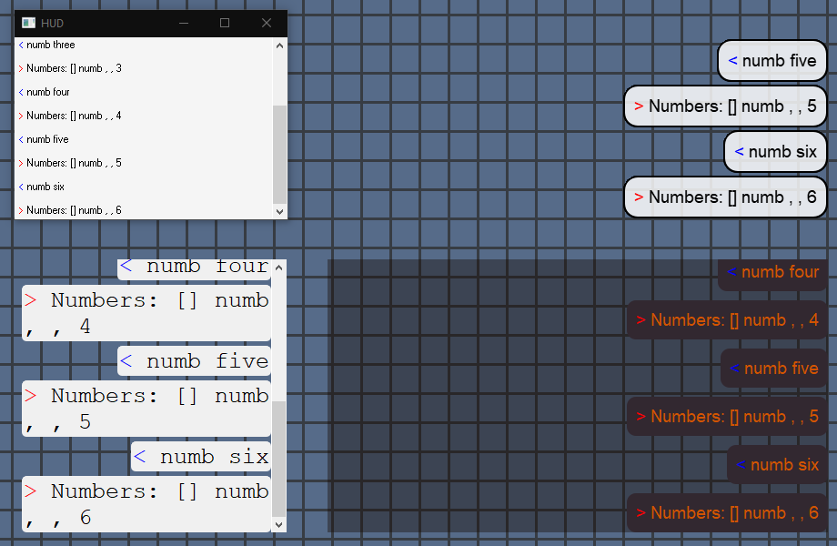
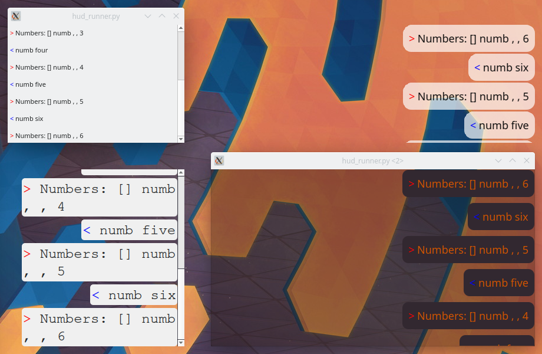
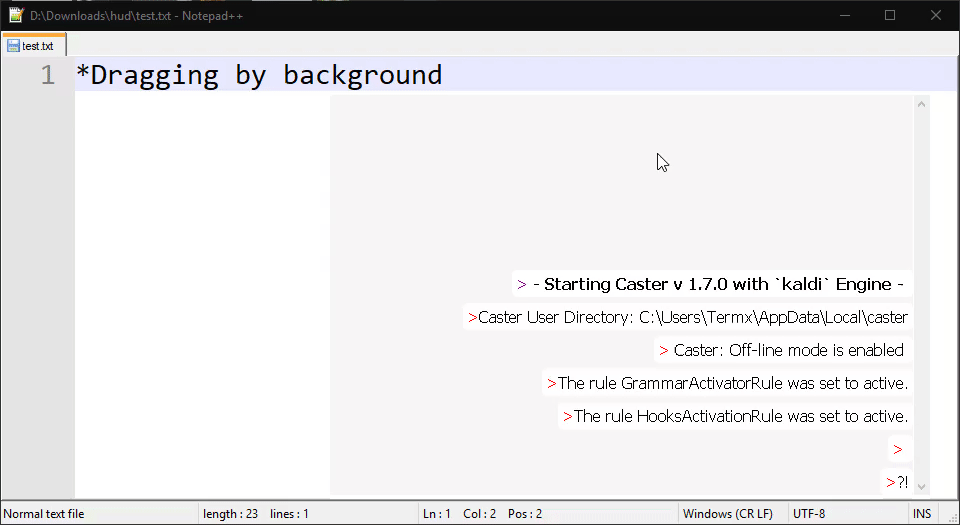
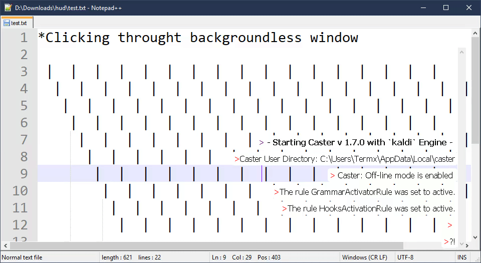

# Caster_command_hud
## Customization Examples:
Windows | Linux
| :---: | :---: |
 |  |

## Usage Examples:
Dragging by background | Clicking through backgroundless window
| :---: | :---: |
 | 

## Settings explanation: 
### setup_window
* window_frameless \<bool> - setting to True, disables window decorations (frame, titlebar) (macOS and Windows require this to be True, for a transparent background)
* width \<int*> - width of the window
* height \<int*> - height of the window
* window_offset_x \<int> - horizontal offset away from screen edge
* window_offset_y \<int> - vertical offset away from screen edge
* window_alignment \<PySide2.QtCore.Qt.Alignment> - alignment of the window position on the screen (ex. Qt.AlignBottom | Qt.AlignRight, would align it to the bottom right corner of the screen)
* screen \<int> - screen on which to open window, invalid values default to 0

\* width, height (accepts float, not necessarily int, but should be limited to int)

### setup_command_log
* direction \<PySide2.QtWidgets.QBoxLayout.Direction> - direction in which command text edits are laid out (ex. QVBoxLayout.TopToBottom, would make new command text edits be added below previous ones)
* alignment \<PySide2.QtCore.Qt.Alignment> - alignment of the command text edits in the window (ex. Qt.AlignRight | Qt.AlignBottom would start filling command text edits from bottom to top, and align them to the right side of the window)
* scroll_bar_off \<bool> - setting to True, disables scroll_bar
* draw_frame \<bool> - setting to True, draws a simple frame around the main widget (different from the window frame, which allows to resize windows. This one is purely visual)
* border_radius \<int*> - radius of the rectangle's corners (uses absolute measurements)
* rect_outline_color \<tuple*> - rectangle outline color 
* rect_outline_width \<int*> -  rectangle outline width, setting to 0 disables outline
* margins \<int*> - margins of the command text edits
* spacing \<int*> - spacing between command text edits
* force_disable_background \<bool> - sets a mask which disables the background of the window (required on linux, to be able to click through the window. For Windows and MacOS (testing needed) it's better to set background_color alpha to 0). Might also disable window decorations on some setups and cause jittery updates.

\* border_radius, margins, spacing, rect_outline_width (should accept float, not necessarily int, but currently can't)

\* rect_outline_color (is tuple of ints (R, G, B, A), but maybe should be PySide2.QtGui.QColor)

### setup_theme
* background_color \<tuple*> - the background color of the window (ex. (50, 0, 0, 10), would be a lightly red almost fully transparent window.) Setting the alpha of this to 0 is the preferred way to disable the background on Windows and MacOS (testing needed)
* text_color \<tuple*> - the color of the text
* font_size \<int*> - size of the font (measured in pixel size)
* font_family \<str> - the family name of the font
  > The family name may optionally also include a foundry name, e.g. “Helvetica [Cronyx]”. If the family is available from more than one foundry and the foundry isn’t specified, an arbitrary foundry is chosen. If the family isn’t available a family will be set using the font matching algorithm. 

  [cited from qt docs](https://doc.qt.io/qtforpython-5/PySide2/QtGui/QFont.html#PySide2.QtGui.PySide2.QtGui.QFont.setFamily)
* rect_color \<tuple*> - color of the rectangle
* font_subpixel_aa \<bool> - setting to True enables subpixel anti aliasing

\* background_color, text_color, rect_color (are tuple of ints (R, G, B, A), but maybe should be PySide2.QtGui.QColor)

\* font_size (can be float, not necessarily int)
