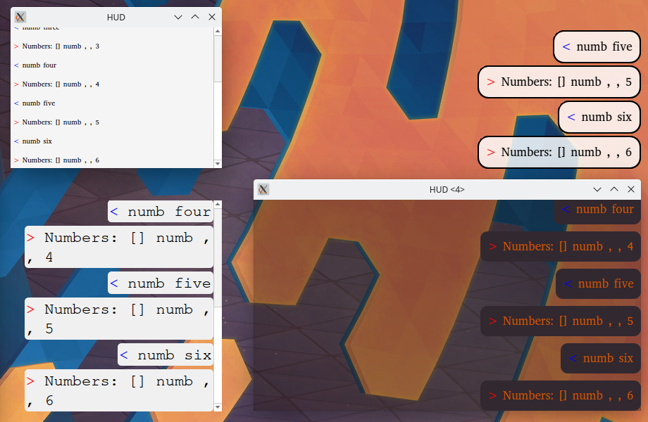

# Caster_command_log
## Customization Examples:
Windows | Linux
| :---: | :---: |
 |  |

## Usage Examples:
Dragging by background | Clicking through backgroundless window
| :---: | :---: |
 | 

## Settings explanation: 
[the footnotes are notes, for likely changes in the future]
### setup_window[^1]
* frameless \<bool> - setting to True, disables window decorations (frame, titlebar) (macOS and Windows require this to be True, for a transparent background)
* width \<int*> - width of the window
* height \<int*> - height of the window
* margin \<int*> - margin away from screen edge, where to position the window[^2]
* alignment \<PySide2.QtCore.Qt.Alignment> - alignment of the window position on the screen (ex. Qt.AlignBottom | Qt.AlignRight, would align it to the bottom right corner of the screen)

\* width, height, margin (accepts float, not necessarily int, but should be limited to int)

[^1]: [maybe all of these variable names should start with window_]
[^2]: [change to offset_x and offset_y, for ability to position the window anywhere]

### setup_command_log
* direction \<PySide2.QtWidgets.QBoxLayout.Direction> - direction in which command text edits are laid out (ex. QVBoxLayout.TopToBottom, would make new command text edits be added below previous ones)
* alignment \<PySide2.QtCore.Qt.Alignment> - alignment of the command text edits in the window (ex. Qt.AlignRight | Qt.AlignBottom would start filling command text edits from bottom to top, and align them to the right side of the window)
* scroll_bar_off \<bool> - setting to True, disables scroll_bar [^3] 
* draw_rect \<bool> - setting to True, draws a rectangle below text
* draw_frame \<bool> - setting to True, draws a simple frame around the main widget (different from the window frame, which allows to resize windows. This one is purely visual) [^4]
* border_radius \<int*> - radius of the rectangle's corners (uses absolute measurements)
* margins \<int*> - margins of the command text edits [^5]
* spacing \<int*> - spacing between command text edits
* force_disable_background \<bool> - sets a mask which disables the background of the window (required on linux, to be able to click through the window. For Windows and MacOS (testing needed) it's better to set background_color alpha to 0)

\* border_radius, margins, spacing (should accept float, not necessarily int, but currently can't)

[^3]: [maybe change type to PySide2.QtCore.Qt.ScrollBarPolicy, so it's possible to set Qt.ScrollBarAsNeeded. Otherwise at least reverse, so True enables scrollbar]
[^4]: [maybe automatically set this, according to other settings. Otherwise rename to draw_inner_frame or similar] 
[^5]: [maybe rename to rect_margins]

### setup_theme
* background_color \<tuple*> - the background color of the window (ex. (50, 0, 0, 10), would be a lightly red almost fully transparent window.) Setting the alpha of this to 0 is the preferred way to disable the background on Windows and MacOS (testing needed)
* text_color \<tuple*> - the color of the text
* font_size \<int*> - size of the font (currently measured in pixel size[^6])
* font_family \<str> - the family name of the font
  > The family name may optionally also include a foundry name, e.g. “Helvetica [Cronyx]”. If the family is available from more than one foundry and the foundry isn’t specified, an arbitrary foundry is chosen. If the family isn’t available a family will be set using the font matching algorithm. 

  [cited from qt docs](https://doc.qt.io/qtforpython-5/PySide2/QtGui/QFont.html#PySide2.QtGui.PySide2.QtGui.QFont.setFamily)
* rect_color \<tuple*> - color of the rectangle
* font_subpixel_aa[^7] \<bool> - setting to True enables subpixel anti aliasing

\* background_color, text_color, rect_color (are tuple of ints (R, G, B, A), but maybe should be PySide2.QtGui.QColor)

\* font_size (can be float, not necessarily int)

[^6]: [maybe change to point size?]
[^7]: [will remove this, because I can't see a reason to ever turn it off]
